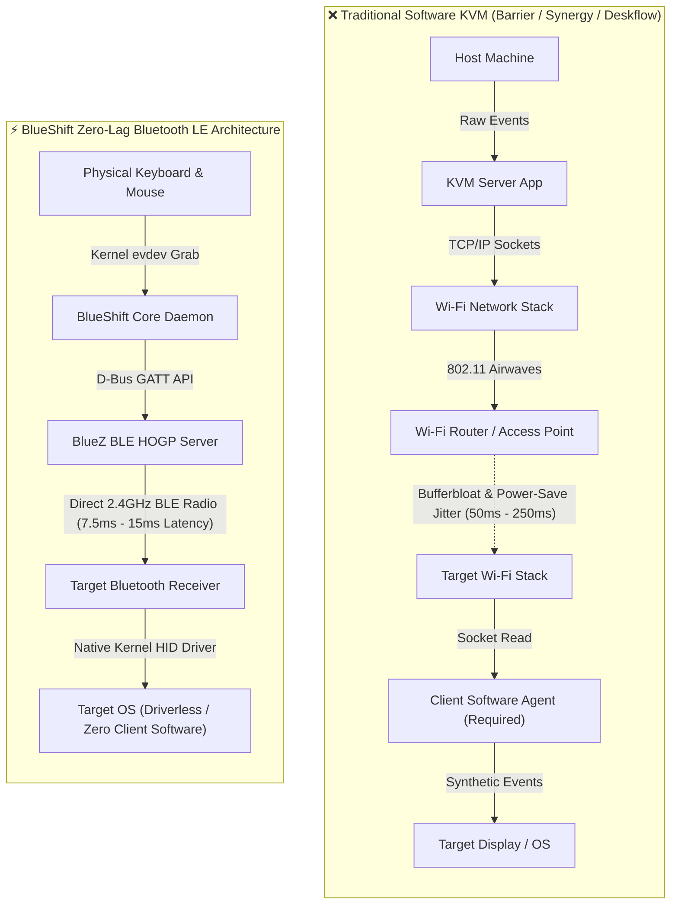
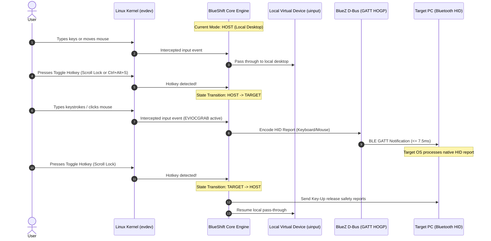

<div align="center">

# ⚡ BlueShift

### **Zero-Lag Bluetooth KVM for Linux**

*Share a single keyboard and mouse across two Linux PCs over Bluetooth Low Energy with zero Wi-Fi lag, kernel-level evdev grabbing, and instant hotkey switching.*

[](https://www.python.org/)
[](https://kernel.org/)
[](https://wayland.freedesktop.org/)
[](http://www.bluez.org/)
[](https://www.bluetooth.com/specifications/specs/hid-over-gatt-profile-1-0/)
[](LICENSE)
[](CONTRIBUTING.md)

[Quick Start](#-quick-start) • [Why BlueShift?](#-why-blueshift) • [Architecture](#-architecture--how-it-works) • [Installation](#-installation) • [CLI & GUI](#-cli--gui-usage) • [Configuration](#-configuration) • [Troubleshooting](#-troubleshooting--faq)

---

</div>

## 📖 Overview

**BlueShift** turns your primary Linux PC into a high-performance **Bluetooth Low Energy (BLE) Human Interface Device (HID)** peripheral. With a single keystroke (`Scroll Lock` or `Ctrl + Alt + S`), BlueShift instantly grabs your physical keyboard and mouse at the Linux kernel level and streams raw HID reports directly over Bluetooth to a second PC.

No Wi-Fi dependencies. No IP network jitter. No client-side software required on the target machine.

---

## ⚡ Why BlueShift?

Traditional software KVM solutions (such as Barrier, Synergy, or Deskflow) transmit keystrokes and mouse coordinates over TCP/UDP network sockets. In modern computing environments, this leads to frustrating bottlenecks:

| Problem in Traditional Software KVMs | How BlueShift Solves It |
| :--- | :--- |
| **802.11 Wi-Fi Power-Save Latency Spikes**: Wi-Fi chips enter power-saving states periodically, causing 50ms–250ms mouse stuttering and repeated sticky keys. | **Direct BLE Radio Link**: BlueShift utilizes Bluetooth Low Energy GATT HOGP with an ultra-tight connection interval of **7.5ms–15ms**, ensuring fluid, real-time mouse tracking. |
| **Corporate Network Isolation**: Enterprise, university, and public Wi-Fi networks block peer-to-peer traffic via Client Isolation (AP Isolation) and 802.1X firewalls. | **Zero Network Dependency**: BlueShift communicates strictly over 2.4 GHz Bluetooth. You don't even need an active internet or LAN connection. |
| **VPN Routing Conflicts**: Work VPNs frequently enforce full-tunnel routing, instantly severing local IP subnet connections to companion PCs. | **VPN Immune**: Because BlueShift operates below the IP layer, corporate VPNs on either machine have zero effect on your connection. |
| **Air-Gapped & High-Security Workstations**: Strict security policies forbid sharing IP network access between development and production laptops. | **Physical Air-Gap Maintained**: Operates as a pure wireless peripheral with AES-CCM 128-bit hardware-level encryption. |
| **Target Client Software Required**: Other solutions require installing, configuring, and maintaining background daemons on both computers. | **Driverless Target**: The target machine sees your host as an ordinary standard Bluetooth keyboard and mouse. Zero software is installed on the target. |
| **Wayland & Lockscreen Key Trapping**: User-space window grabbers often drop hotkeys on Wayland compositors or lockscreens. | **Kernel-Level `evdev` Grabbing**: Intercepts `/dev/input/event*` with `EVIOCGRAB`, guaranteeing 100% reliable hotkey switching regardless of display server or lock state. |

---

## 🏗 Architecture & How It Works

BlueShift sits directly between the Linux input subsystem (`evdev`), the local virtual input driver (`uinput`), and the BlueZ D-Bus GATT server:



### Event Flow & State Machine



---

## 🎯 Key Features

- **Direct Bluetooth LE HID (HOGP)**: Fully compliant with Bluetooth SIG HID over GATT Profile (HOGP) 1.0. Emulates standard 104-key keyboard and 5-button mouse.
- **True Zero Wi-Fi Jitter**: Direct radio packets eliminate packet buffering, Wi-Fi channel hops, and multicast packet drops.
- **Kernel-Level `evdev` Exclusive Grabbing**: BlueShift locks physical input devices using Linux kernel `EVIOCGRAB`. Your local desktop never receives stray characters or mouse movements while interacting with the target machine.
- **Instant Hotkey Switching**: Single-tap `Scroll Lock`, `Ctrl + Alt + S`, or double-tap custom modifiers to switch computers in under 1 millisecond.
- **Smart Security Token Isolation**: Automatically detects and ignores hardware security keys (e.g., YubiKeys, OnlyKeys, smartcard readers) so your credentials remain isolated to your host PC.
- **Wayland & X11 Native**: Because BlueShift hooks into `/dev/input`, it works identically across Sway, Hyprland, GNOME Shell (Wayland/X11), KDE Plasma (Wayland/X11), XFCE, and headless TTYs.
- **Driverless Target Support**: Target machine can run Linux, Windows, macOS, Android, or iPadOS without installing any software or root agents.
- **Lightweight & Efficient**: Native asynchronous event loop consuming `< 1%` CPU and `< 25MB` RAM.
- **Systemd User Service**: Starts automatically on login and survives display manager restarts.

---

## 📦 Installation

### Prerequisites

- **Host PC (Sender)**: Linux Kernel ≥ 5.8 with a Bluetooth 4.2+ adapter (BLE 5.0+ recommended for lowest latency).
- **Target PC (Receiver)**: Any device with standard Bluetooth HID receiver support.

---

### 1. Arch Linux (AUR & Pacman)

Install via your preferred AUR helper:

```bash
# Using yay
yay -S blueshift-kvm

# Using paru
paru -S blueshift-kvm
```

Or build manually from source:

```bash
sudo pacman -S --needed base-devel git python python-evdev python-pip pkgconf bluez bluez-utils
git clone https://github.com/uckix/blueshift.git
cd blueshift
pip install .
```

---

### 2. Debian / Ubuntu / Parrot OS

```bash
# 1. Install system dependencies
sudo apt update
sudo apt install -y python3-dev python3-pip python3-evdev python3-dbus bluez libbluetooth-dev pkg-config

# 2. Install BlueShift via pipx or pip
pipx install git+https://github.com/uckix/blueshift.git
# or
git clone https://github.com/uckix/blueshift.git
cd blueshift
pip install .
```

---

### 3. Fedora / RHEL

```bash
# 1. Install system dependencies
sudo dnf install -y python3-devel python3-pip python3-evdev python3-dbus bluez bluez-libs-devel pkgconf

# 2. Install BlueShift
pipx install git+https://github.com/uckix/blueshift.git
```

---

### 4. Bluetooth & User Permissions Setup

BlueShift needs permission to capture `/dev/input/event*`, create virtual devices in `/dev/uinput`, and register GATT services via BlueZ.

#### Step A: Add your user to groups
```bash
sudo usermod -aG input,bluetooth $USER
```

#### Step B: Install udev rule for `/dev/uinput`
```bash
echo 'KERNEL=="uinput", GROUP="input", MODE="0660"' | sudo tee /etc/udev/rules.d/99-blueshift.rules
sudo udevadm control --reload-rules && sudo udevadm trigger
```

#### Step C: Enable BlueZ Experimental Features
BLE Peripheral / GATT Server functionality requires BlueZ experimental mode:

1. Edit `/etc/bluetooth/main.conf`:
   ```ini
   [General]
   Experimental = true
   ```
2. Restart the Bluetooth service:
   ```bash
   sudo systemctl restart bluetooth
   ```

> [!IMPORTANT]
> Log out and log back in (or run `newgrp input`) so group permissions take effect.

---

## 🚀 Quick Start Guide

### Step 1: Run the Doctor Diagnostic
Verify that your Bluetooth adapter and kernel permissions are correctly configured:

```bash
blueshift doctor
```

### Step 2: Pair with Target PC
Launch BlueShift's interactive pairing wizard:

```bash
blueshift pair
```
1. On your **Target PC**, open Bluetooth Settings and click **Add Device**.
2. Select **"BlueShift KVM"** from the list.
3. Accept the pairing prompt on both screens.

### Step 3: Start BlueShift Daemon
```bash
blueshift daemon
```

### Step 4: Toggle & Switch!
- Tap **`Scroll Lock`** or press **`Ctrl + Alt + S`**.
- Your keyboard and mouse now seamlessly control the Target PC.
- Press the hotkey again to instantly return to your Host PC.

---

## 💻 CLI & GUI Usage

### Command Line Interface

```text
Usage: blueshift [OPTIONS] COMMAND [ARGS]...

  BlueShift: Zero-Lag Bluetooth KVM for Linux.

Options:
  --version  Show the version and exit.
  --help     Show this message and exit.

Commands:
  daemon     Run the BlueShift background daemon.
  gui        Launch the GTK4 / PyQt system tray and settings GUI.
  pair       Start BLE advertising to pair with a target machine.
  switch     Switch active target (host | target | toggle).
  status     Show current connection state and active target.
  devices    List physical input devices detected by evdev.
  doctor     Run full system diagnostics and hardware checks.
```

#### Handy CLI Commands:

```bash
# Check status
blueshift status

# Manually switch focus via script or terminal shortcut
blueshift switch target
blueshift switch host
blueshift switch toggle

# View detected input devices
blueshift devices

# Launch daemon in debug mode
blueshift daemon --log-level DEBUG
```

---

### Graphical User Interface (GUI)

Launch the system tray application:

```bash
blueshift gui
```

- **System Tray Icon**:
  - 🟢 **Green**: Active on Host Machine.
  - 🔵 **Blue**: Active on Target Machine (BLE HID streaming).
  - 🔴 **Red**: Bluetooth disconnected / Standby.
- **Tray Menu**:
  - One-click machine switching.
  - Re-pair target device.
  - Device exclusion selector (safelist/blocklist input devices).
  - Live latency monitor (connection interval in ms).

---

## ⚙ Configuration

BlueShift reads its configuration from `~/.config/blueshift/config.toml`. Generate the default configuration with:

```bash
blueshift config --generate
```

### Example `~/.config/blueshift/config.toml`:

```toml
[general]
# Logging verbosity: "DEBUG", "INFO", "WARNING", "ERROR"
log_level = "INFO"

# Initial focus state when daemon boots: "host" or "target"
initial_focus = "host"

# Play subtle audio beep on switch (requires pulseaudio / pipewire)
audio_feedback = true

[hotkeys]
# Primary single-key toggle
primary_toggle = "KEY_SCROLLLOCK"

# Secondary multi-key chord toggle
chord_toggle = ["KEY_LEFTCTRL", "KEY_LEFTALT", "KEY_S"]

# Fallback hotkey
fallback_toggle = "KEY_PAUSE"

# Double-tap window in milliseconds (0 to disable)
double_tap_ms = 350

[devices]
# Automatically grab all standard physical keyboards and mice
grab_all_keyboards = true
grab_all_mice = true

# Regex list of device names to exclude from being grabbed
# Hardware security tokens and audio controls are excluded by default
exclude_devices = [
    ".*YubiKey.*",
    ".*OnlyKey.*",
    ".*SmartCard.*",
    ".*Webcam.*",
    ".*Headset.*"
]

[bluetooth]
# BlueZ adapter interface (usually hci0)
adapter = "hci0"

# Target Bluetooth MAC address (configured automatically during pairing)
target_address = "AA:BB:CC:DD:EE:FF"

# BLE Connection Parameters (in milliseconds)
# 7.5ms is the absolute minimum allowed by the Bluetooth Low Energy spec
conn_interval_min_ms = 7.5
conn_interval_max_ms = 15.0
slave_latency = 0
supervision_timeout_ms = 2000

[mouse]
# Sensitivity multiplier for target PC
sensitivity_scale = 1.0

# Scroll wheel step multiplier
scroll_multiplier = 1.0

# Invert vertical scroll direction on target PC
natural_scrolling = false
```

---

## 🛠 Systemd Service Integration

Run BlueShift automatically whenever you log in:

1. Create the systemd user service file:
   ```bash
   mkdir -p ~/.config/systemd/user
   blueshift --install-service
   ```

2. Reload systemd and start the service:
   ```bash
   systemctl --user daemon-reload
   systemctl --user enable --now blueshift.service
   ```

3. Check service status:
   ```bash
   systemctl --user status blueshift.service
   ```

---

## 🔒 Security & Privacy Highlights

- **No Remote Network Exposure**: BlueShift has zero network listening sockets. No open TCP/UDP ports, no web servers, and zero exposure to LAN scanning or sniffing.
- **Air-Gapped Operation**: Keeps high-security and corporate machines completely isolated at the IP layer.
- **BLE Security Level 4**: Enforces Bluetooth Low Energy Secure Connections (LE SC) with **AES-CCM 128-bit encryption** and Diffie-Hellman P-256 elliptic curve key exchange.
- **YubiKey & Hardware Token Protection**: Hardware authenticators are explicitly filtered out at the kernel level, ensuring 2FA tokens never accidentally broadcast keystrokes to the target machine.
- **Automatic Failsafe Key Release**: If the Bluetooth connection drops unexpectedly while a key or mouse button is depressed, BlueShift automatically sends HID key-up release frames to prevent stuck keys on the target machine.

---

## ❓ Troubleshooting & FAQ

### Troubleshooting Matrix

| Symptom | Cause | Solution |
| :--- | :--- | :--- |
| `PermissionError: [Errno 13] Permission denied: '/dev/input/eventX'` | Current user is not in the `input` group. | Run `sudo usermod -aG input $USER` and log out/log in. |
| `Bluetooth daemon does not support LE Peripheral mode` | BlueZ experimental mode is disabled. | Add `Experimental = true` under `[General]` in `/etc/bluetooth/main.conf` and restart BlueZ (`sudo systemctl restart bluetooth`). |
| Target machine shows "Connected" then disconnects after 5 seconds | Missing HOGP HID Report Map or GATT service registration failure. | Run `blueshift doctor` to verify GATT table integrity; unpair and re-pair using `blueshift pair`. |
| Mouse feels jittery or sluggish | High connection interval negotiated by target OS. | Set `conn_interval_min_ms = 7.5` and `conn_interval_max_ms = 15.0` in `config.toml`. Ensure 2.4GHz Wi-Fi is not causing heavy channel interference. |
| Host keyboard stops responding after pressing toggle | Virtual device creation in `/dev/uinput` failed. | Ensure `/dev/uinput` is writable. Verify udev rule exists in `/etc/udev/rules.d/99-blueshift.rules`. |

### Frequently Asked Questions

<details>
<summary><b>Can the target computer be a Mac or Windows machine?</b></summary>
<br>
<b>Yes!</b> While BlueShift runs as the host daemon on Linux, the target machine can run <b>Windows 10/11, macOS, iPadOS, Android, or Linux</b>. The target machine simply recognizes BlueShift as a standard Bluetooth Low Energy HID keyboard and mouse. Zero software is required on the target.
</details>

<details>
<summary><b>Does BlueShift support clipboard sharing?</b></summary>
<br>
BlueShift focuses strictly on ultra-low-latency raw HID keyboard and mouse streaming. Clipboard sharing is planned for an upcoming release via Bluetooth L2CAP Credit-Based Channels (CoC) without relying on IP networks.
</details>

<details>
<summary><b>How does BlueShift compare to a hardware USB KVM switch?</b></summary>
<br>
Hardware KVM switches require physical USB and HDMI/DisplayPort cables connected to both desks, take 2–5 seconds to re-enumerate USB devices upon each switch, and introduce desktop cable clutter. BlueShift switches instantaneously (< 1ms) over the air with zero extra cables or hardware purchases.
</details>

<details>
<summary><b>What happens if my Bluetooth controller goes to sleep?</b></summary>
<br>
BlueShift prevents controller idle suspend by asserting a Bluetooth D-Bus wake lock while active and negotiating aggressive BLE supervisory timeouts.
</details>

---

## 🗺 Roadmap

- [x] Kernel-level `evdev` exclusive grabbing & virtual `uinput` pass-through
- [x] Bluetooth Low Energy HOGP GATT server implementation via BlueZ D-Bus
- [x] Single-key toggle (`Scroll Lock`) & configurable chords (`Ctrl + Alt + S`)
- [x] GTK4 / PyQt system tray monitor and settings dialog
- [x] Linux package packaging (Arch, Debian/Ubuntu, Parrot, Fedora)
- [ ] Multi-target switching (switch between up to 3 paired computers)
- [ ] Screen-edge mouse traversal (seamless cursor leaping without pressing hotkeys)
- [ ] Air-gapped Bluetooth L2CAP clipboard synchronization

---

## 🤝 Contributing

Contributions, bug reports, and suggestions are warmly welcome! Please see our [CONTRIBUTING.md](CONTRIBUTING.md) for details on code style, testing without a secondary PC, and submitting pull requests.

---

## 📄 License

This project is licensed under the **MIT License** — see the [LICENSE](LICENSE) file for details.

Copyright © 2026 **uckix**.
